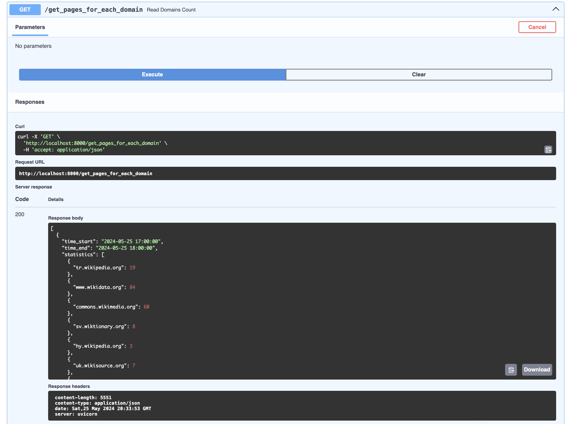
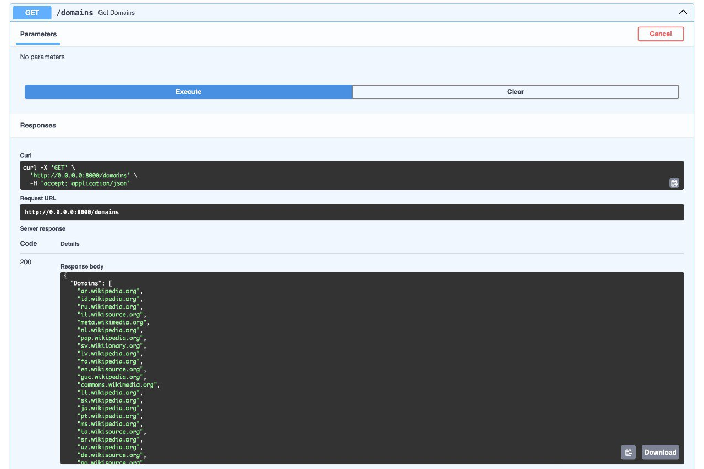

# Project | Wikipedia 🌚 

Authors: **Olha Nahurna, Dmytro Batko**

## 📝 Description

_The project goal is to assemble all the knowledge we obtained during the BigData course. To be more precise we built up the system to process the Wikipedia website data source (https://stream.wikimedia.org/v2/stream/page-create). Below you can see the structure of the README:_

* [Architecture of the system](#architecture-of-the-system)
* [Data Model](#data-model)
* [Usage](#usage)
    * [How to run the application](#how-to-run-the-application)
    * [Results](#results)
* [Conclusions](#conclusions)

## Architecture of the system

The architecture depicted in the diagram represents a data processing pipeline involving Apache Kafka, Apache Spark Streaming, and Cassandra, with a REST API for user interaction.

The data originates from a WIKI SOURCE and is initially ingested into an Apache Kafka topic designated as the input topic. Apache Spark Streaming then processes this data in real-time and publishes the processed data to another Kafka topic. A second instance of Spark Streaming consumes the data from this processed topic for further transformation. The results are stored in a Cassandra database. Finally, a REST API allows users to interact with the system and retrieve the processed data from Cassandra.

## Data Model


As you can see, for Category A and Category B requests we used Cassandra database for its ability to handle high write throughput, ensuring high availability and fault tolerance in real-time data streaming applications. Also, because of its distributed architecture, which allows horizontal scaling, we could manage large volumes of continuous data efficiently.

## Usage
### How to run the application

1. Clone the repository:
```bash
git clone https://github.com/linndfors/BigData_Wiki.git
```
2. Go to `BigData_Wiki` repository:
```bash
cd BigData_Wiki
```
3. Add permissions for the bash files:
```bash
chmod +rwx create-topics.sh docker-create-table.sh build-containers.sh
```
4. Start installations of Apache Cassandra, Apache Kafka, Apache Spark and app container by running `docker-compose.yaml` file:
```bash
docker-compose up --build -d
```
You can also run the command to see that the system is running
```bash
docker ps
```
5. Create topics; keyspace and table; build containers:
```bash
./create-topics.sh

./build-containers.sh

# wait until cassandra started
./docker-create-table.sh
```
6. Open three additional terminal windows:
```bash
docker run -it --rm --network bigdata_wiki_spark-network --name kafkaapp -v /Users/linndfors/study/BigData/BigData_Wiki:/opt/app bitnami/spark:3 /bin/bash

cd /opt/app/kafka_app
spark-submit --total-executor-cores 2 --conf spark.jars.ivy=/opt/app --packages "org.apache.spark:spark-sql-kafka-0-10_2.12:3.2.0" --master spark://spark-master:7077 --deploy-mode client kafka_to_kafka.py
```

```bash
docker run --rm -it --network bigdata_wiki_spark-network --name casapp -v /Users/linndfors/study/BigData/BigData_Wiki:/opt/app bitnami/spark:3 /bin/bash

cd /opt/app/cas_app/
spark-submit --total-executor-cores 2 --conf spark.jars.ivy=/opt/app --packages "org.apache.spark:spark-sql-kafka-0-10_2.12:3.2.0,com.datastax.spark:spark-cassandra-connector_2.12:3.2.0" --master spark://spark-master:7077 --deploy-mode client kafka_to_cassandra.py
```

```bash
docker run --network bigdata_wiki_spark-network wikiapp
```

### Results
#### Category A:
1. Return the aggregated statistics containing the number of created pages for each Wikipedia domain for each hour in the last 6 hours, excluding the last hour. The response example for the request made at 19:32:
```json
[{“time_start”: “12:00”,
  “time_end”: “13:00”,
  “statistics”: [{“fr.wikisource.org”: 342}, {“nl.wikipedia.org” : 127}, ... ]},
 {“time_start” : “13:00”,
  “time_end”: “14:00”,
  “statistics”: [{“uk.wikipedia.org” : 107}, ... ]},
…
 {“time_start” : “17:00”,
  “time_end”: “18:00”,
  “statistics”: [{“fr.wikisource.org”: 32}, ... ]}
]
```
Result:




2. Return the statistics about the number of pages created by bots for each of the domains for the last 6 hours, excluding the last hour. The response example:
```json
{“time_start” : “12:00”,
 “time_end”: “18:00”,
 “statistics”: [{“domain”: “fr.wikisource.org”, “created_by_bots” : 312}, {“domain”: “nl.wikipedia.org”, “created_by_bots”: 109}, ... ]}
```
Result:


3. Return Top 20 users that created the most pages during the last 6 hours, excluding the last hour. The response should contain user name, user id, start and end time, the list of the page titles, and the number of pages created.

Results:


#### Category B:
1. Return the list of existing domains for which pages were created.


2. Return all the pages which were created by the user with a specified user_id.


3. Return the number of articles created for a specified domain.


4. Return the page with the specified page_id


5. Return the id, name, and the number of created pages of all the users who created at least one page in a specified time range.


## Conclusions
This project was a valuable experience in applying and consolidating the skills and knowledge gained from our course. 

We successfully developed a system capable of handling a streaming data source from an existing online resource, and showing it in HTTP requests. Although the system only works in back-end, the future work may be integration it with front-end, enabling the user to use it for his needs.

Last but not least, we want to say thanks to teacher and assistants for your work! ❤️
