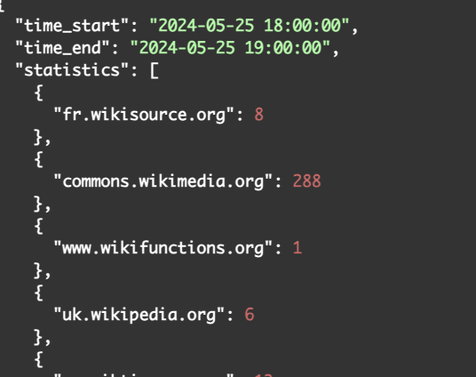
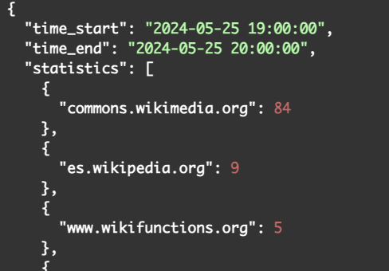

# Homework 12: 🤖 Apache Spark + Kafka + Cassandra

Author: **Olha Nahurna**

## 📝 Description
The main goal of this homework is to learn how to write programs for data processing using the Apache Stream, Kafka and Cassandra.

## 🖥 Usage

### How to run the application

1. Clone the repository
2. ```cd homework12```
3. Add permissions\
```chmod +rwx create-topics.sh docker-create-table.sh build-containers.sh```
4. Start containers\
```docker-compose up -d```\
```docker ps```\

5. Create topics\
```./create-topics.sh```

6. (Optional) Run consumers to check messages:
```
docker run -it --rm --network bigdata_wiki_spark-network -e KAFKA_CFG_ZOOKEEPER_CONNECT=zookeeper-server:2181 bitnami/kafka:latest kafka-console-consumer.sh --bootstrap-server kafka:9092 --topic input
docker run -it --rm --network bigdata_wiki_spark-network -e KAFKA_CFG_ZOOKEEPER_CONNECT=zookeeper-server:2181 bitnami/kafka:latest kafka-console-consumer.sh --bootstrap-server kafka:9092 --topic processed
```

7. Create keyspace and table:
```
./docker-create-table.sh
```

8. Build containers:
```
./build-containers.sh
```

9. Run main scripts in different consoles:
```
docker run -it --rm --network bigdata_wiki_spark-network --name kafkaapp -v /Users/linndfors/study/BigData/BigData_Wiki:/opt/app bitnami/spark:3 /bin/bash

cd /opt/app/kafka_app
spark-submit --total-executor-cores 2 --conf spark.jars.ivy=/opt/app --packages "org.apache.spark:spark-sql-kafka-0-10_2.12:3.2.0" --master spark://spark-master:7077 --deploy-mode client kafka_to_kafka.py
```

```
docker run --rm -it --network bigdata_wiki_spark-network --name casapp -v /Users/linndfors/study/BigData/BigData_Wiki:/opt/app bitnami/spark:3 /bin/bash

cd /opt/app/cas_app/
spark-submit --total-executor-cores 2 --conf spark.jars.ivy=/opt/app --packages "org.apache.spark:spark-sql-kafka-0-10_2.12:3.2.0,com.datastax.spark:spark-cassandra-connector_2.12:3.2.0" --master spark://spark-master:7077 --deploy-mode client kafka_to_cassandra.py
```

```
docker run --network bigdata_wiki_spark-network wikiapp
```

10. To check res\
```
docker run -it --network bigdata_wiki_spark-network --rm cassandra cqlsh bigdata_wiki-cassandra-1
```
```cqlsh
cqlsh> use fancy_keyspace ;
cqlsh:hw12_nahurna> select * from created_pages ;
```

### Results
Wiki - > Kafka <b>input</b> topic\


Kafka <b>input</b> - > Kafka <b>processed</b>\


Kafka <b>processed</b> - > Cassandra


#### Configs



8. Don't forget to ```docker-compose down```
